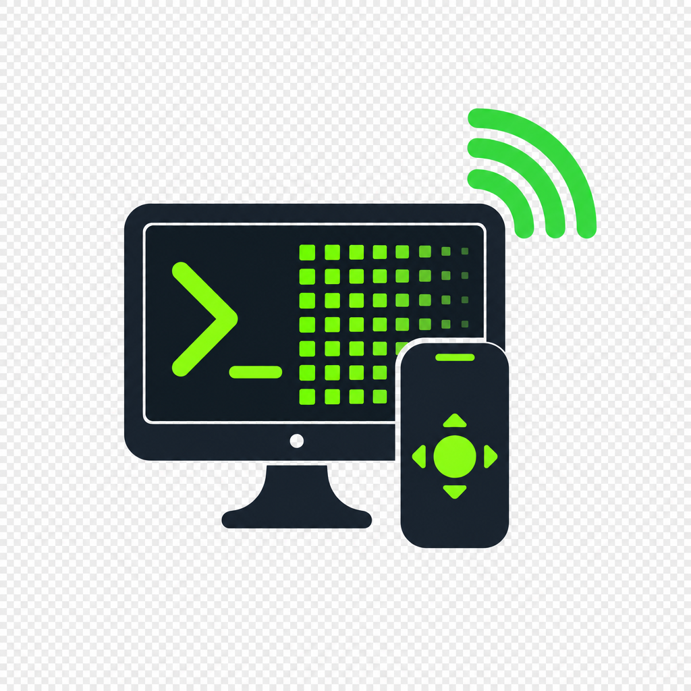
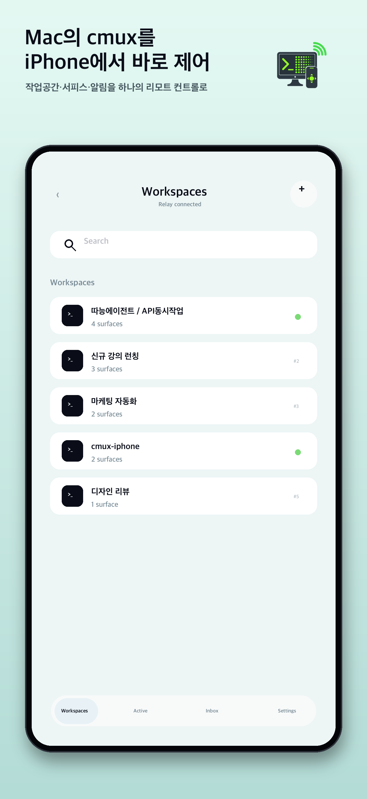
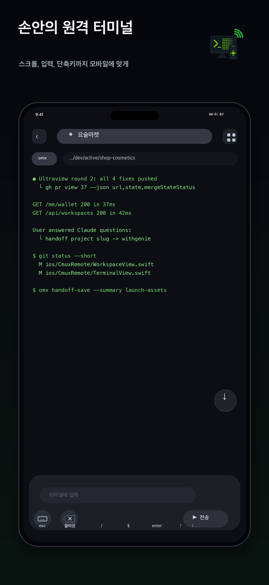
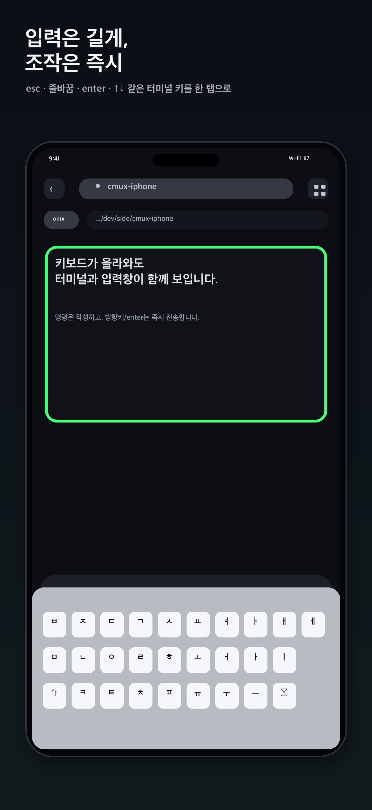
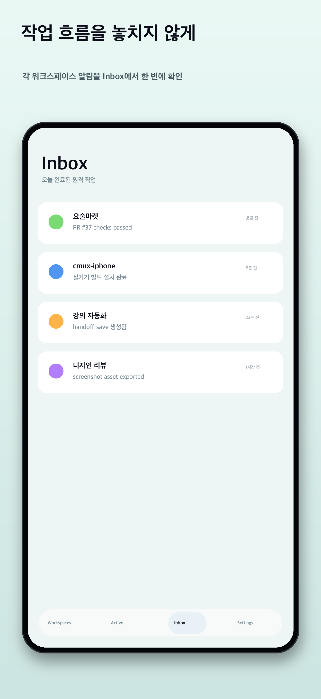
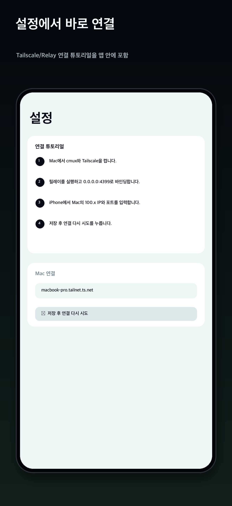

[🇰🇷 한국어](README.md) · 🇺🇸 English

# cmux Remote

> Unofficial iPhone remote for [cmux](https://github.com/manaflow-ai/cmux)
> on your Mac, over Tailscale.

cmux Remote is a SwiftUI app + Swift daemon pair that lets you read and
drive the terminals running inside cmux on your Mac, from anywhere on
your Tailscale tailnet. No port is ever exposed to the public internet
— every byte travels over your existing WireGuard mesh.

This is a community project and is **not** built or endorsed by
Manaflow. cmux Remote is an independent network client that talks to
cmux exclusively over a documented JSON-RPC protocol.

---

## Status

**Early preview (v1.0.5).** It can:

- list, open, create, rename, and close cmux workspaces and surfaces
- mirror any terminal surface in near real-time (15 Hz diff polling, 120-line bounded history)
- send keystrokes, key combinations, raw text, command lines, and live per-character input
- surface cmux notifications as iOS local notifications (while the app
  is alive)
- paste iPhone clipboard text into the command composer
- attach iPhone photos by saving them to the Mac under
  `~/Downloads/cmux-remote/` and inserting the saved path
- show the connected MacBook battery state in the workspace header
- surface Claude/Codex-style `needs input` events in the Inbox
- keep the terminal input panel flush with the bottom edge and add extra scroll room so hidden terminal rows can be revealed
- pin cmux pane focus on every send

Smoke-tested against macOS 14 + iOS 17 on both LAN and across a Tailnet
(Tailscale 1.84+), on simulator and a physical iPhone.

> **Notification caveat** — current notifications are *local*: iOS
> banners only fire while the app is foregrounded, or while it's still
> alive in the background with an open WebSocket. True APNs push (so
> banners arrive when the app is killed or has been backgrounded for a
> long time) is on the v1.1 roadmap.

---

## Changelog

> Recent changes, newest first. Format: `date · version/scope · summary`.
> Scopes — `app` (iOS app) · `relay` (Mac daemon) · `setup` (install/docs).
> Per-version App Store notes live in
> [`docs/launch-assets/release-notes/`](docs/launch-assets/release-notes/).

- **2026-06-06 · relay** — Track cmux's relocated socket after cmux 1.0.5 moved its Unix socket from `~/Library/Application Support/cmux` to `~/.local/state/cmux`. `cmuxSocketPath()` now follows the markers newest-convention-first (`/tmp/cmux-last-socket-path` → `~/.local/state/cmux/last-socket-path` → legacy Application Support), falling back to `~/.local/state/cmux/cmux.sock`. **No iOS app change → no App Store resubmission.**
- **2026-06-05 · v1.0.5 (app)** — LIVE per-character input mode, Korean/Hangul IME protection (no jamo splitting), bottom-flush input panel, five extra terminal scroll rows, improved `needs input` Inbox coverage.
- **2026-06-05 · setup** — Foolproof relay install script + connection guide (`docs/connection-guide.md`).
- **2026-05-29 · v1.0.4 (app)** — Cached parsed rows/style runs for faster terminal rendering, 120-line bounded history, 256-color/true-color ANSI, better checksum reconciliation.
- **2026-05-28 · v1.0.3 (relay)** — Fix repeated "Connection refused" when cmux rotates its socket, default dynamic socket discovery on reinstall, socket-path regression tests.
- **2026-05-24 · v1.0.2 (app)** — Mobile keyboard behavior, workspace create/rename/close, image attachments, connected-computer battery status, Inbox improvements.

---

## Screenshots

<p align="center">
  
</p>

<table>
  <tr>
    <td align="center" width="20%"><br><sub>Workspace / surface chip bar</sub></td>
    <td align="center" width="20%"><br><sub>Live terminal mirror</sub></td>
    <td align="center" width="20%"><br><sub>Key accessory bar</sub></td>
    <td align="center" width="20%"><br><sub>Notification Inbox</sub></td>
    <td align="center" width="20%"><br><sub>Settings · pairing guide</sub></td>
  </tr>
</table>

---

## Why?

cmux is a fantastic Mac-native terminal for AI coding agents, but the
moment you walk away from your desk it goes dark. cmux Remote gives you
a thin glass pane onto the same workspaces while you're on the couch,
on a train, or debugging from a coffee shop. The Mac is still doing all
the work — the iPhone is just a remote.

---

## Architecture

```
iPhone (iOS 17+)         Tailscale            Mac
┌─────────────────────┐                       ┌────────────────────────────────┐
│ cmux Remote (app)   │── HTTP + WS ─────────▶│ cmux-relay (Swift, launchd)    │
│  · workspace list   │   (Tailscale encrypts)│  · HTTP/1.1 routes             │
│  · terminal mirror  │                       │  · /v1/stream WebSocket        │
│  · accessory bar    │◀── events.stream ─────│  · DiffEngine (15 Hz polling)  │
│  · local notifs     │                       │  · Tailscale whois auth        │
└─────────────────────┘                       │  · device tokens + rate limit  │
                                              └─────────────┬──────────────────┘
                                                            │ Unix socket
                                                            │ JSON-RPC
                                                            ▼
                                              ┌────────────────────────────────┐
                                              │ cmux.app                       │
                                              │ ~/.local/state/cmux/cmux.sock  │
                                              └────────────────────────────────┘
```

Two pieces to install:

1. **`cmux-relay`** — a small Swift daemon on the same Mac as cmux. It
   speaks JSON-RPC to cmux's local Unix socket and exposes an HTTP +
   WebSocket API on your tailnet interface. TLS is provided by the
   Tailscale WireGuard transport itself.
2. **cmux Remote (iOS)** — the SwiftUI app on your iPhone. It only
   talks to your own relay; nothing ever leaves your tailnet.

This repo deliberately ships **no** cmux source code. It is a network
client that talks to cmux over a documented JSON-RPC schema.

---

## Features

### Workspaces / surfaces

- Workspace and terminal-surface listing
- Workspace creation with the requested title sent to cmux as `workspace.create.title`
- Workspace rename (`workspace.rename`) and close (`workspace.close`) from the workspace list
- In-app surface create / close from the chip bar (with confirmation
  dialog and automatic fallback selection)
- Auto re-subscribe and bottom-pin on workspace / surface switch
- First-RPC gate (`CMUXClient.awaitReady`) so the inbound bridge is
  installed before any call goes out

### Terminal mirror

- 15 Hz diff polling, full-text fallback, checksum-based reconcile
- 120-line bounded history to avoid abrupt 24-line refreshes on surface switch / reload
- Extra five-row bottom scroll padding so rows behind the input accessory can be pulled fully into view
- Cached render rows and style runs, drawn through Canvas in run-sized batches for faster scroll and zoom
- Tokyo Night Storm palette, ANSI 256-color / true-color rendering groundwork, plus a CRT scanline shader
- Correct East-Asian wide-glyph cell width
- Suppresses iOS auto-promotion of glyphs like ● ⏺ ✔ ▶ to color emoji
  (Variation Selector-15 plus a small substitution table)

### Input

- Accessory bar: `esc` `OK` `/` `$` `tab` `← ↑ ↓ →` `/new` `space`
- **LIVE input mode** for immediate per-character terminal input without pressing submit
- Dedicated keyboard-dismiss, backspace, iPhone clipboard paste, and
  photo attach buttons
- Command composer with text + enter as one shot; the software keyboard
  closes automatically after submit
- Korean/Hangul IME text stays out of LIVE immediate-send mode so composed syllables do not split into jamo
- Photo attachments are saved by the Mac relay under
  `~/Downloads/cmux-remote/`, then the saved path is inserted into the
  command field
- `surface.send_key` is delivered via an `NSEvent` synth on the Mac
  side, so multi-byte sequences (arrows, ctrl-combos) arrive
  atomically — important for Ink-based TUIs (Claude Code etc.) whose
  ESC parser fires on a lone ESC byte if the rest of the sequence is
  even a few ms behind.
- **Focus gate** — every subscribe, resubscribe, and every `sendKey`
  re-pins `surface.focus` first. iPhone keys land on the surface you
  intended even after focus moved at the Mac.

### Notifications

- Surfaces cmux `events.stream` notifications as iOS local
  notifications via `UNUserNotificationCenter`, grouped per workspace
  by `threadIdentifier`
- Authorization is requested lazily, pre-warmed once at app launch
- Duplicate-id guard — a reconnect that re-emits the same notification
  only fires one banner
- Inbox view holds the most recent 200 entries (newest first)
- Claude/Codex-style `needs input`, `needs attention`, and approval events are promoted into the same Inbox stream
- Deep link `cmux://surface/<id>` (will be joined by APNs payload
  routing in M6)
- `SEND TEST NOTIFICATION` button in Settings: a local inject for
  immediate Inbox/banner confirmation, plus a separate status line for
  the relay→cmux→events.stream round-trip

### Mac relay

- HTTP/1.1 with WebSocket upgrade (`SwiftNIO`)
- JSON-RPC 2.0 dispatch
- DiffEngine — actor-based, per-device FPS budget, row-granular diffs
- Auth via Tailscale UDS `whois` (foreground service) with a GUI
  fallback
- Hashed bearer tokens per device, revocable individually from the
  menu bar
- Per-device rate limiter and `boot_id`-driven reset broadcast
- Ships as a launchd user agent, with an injected `PATH` so the
  `tailscale` CLI is reachable from a stripped launchd environment
- Connected Mac battery lookup via `host.battery`, displayed as an iPhone header badge
- iPhone photo uploads saved only under `~/Downloads/cmux-remote/` via `file.upload`
- Dedicated cmux UDS channel for the events stream (the subscribed
  channel becomes push-only and won't accept further RPC responses)

### Security

- Relay binds to `0.0.0.0` but refuses non-Tailscale source addresses
  at the application layer (`EndpointPolicy`)
- Per-device tokens with menu-bar revoke
- Notification payloads never contain terminal contents — only a
  workspace/surface id and a short title
- No telemetry, no analytics, no third-party network calls

---

## Requirements

### Mac (the relay)

- macOS 13 Ventura or newer
- A working [cmux](https://github.com/manaflow-ai/cmux) installation
  with its Unix socket exposed (default
  `~/.local/state/cmux/cmux.sock`)
- Swift 5.10 toolchain (Xcode 15.3+) to build from source
- Tailscale installed and signed in
- A free TCP port for the relay (default `4399`)

### iPhone

- iOS 17 or newer
- Same Tailnet as your Mac (Tailscale app signed in)
- Apple Developer account for sideloading (the free 7-day personal
  cert works; App Store distribution needs a paid account)

### Network

- Tailscale 1.84+ on both ends
- No Funnel, no public hostname required

---

## Quickstart

> **Can't connect?** If this is a first install, or the app says it
> can't reach your Mac, follow the step-by-step setup + troubleshooting
> guide anyone can apply →
> **[Connection guide (docs/connection-guide.en.md)](docs/connection-guide.en.md)**

### 0. Before you start (on the Mac)

The relay runs on the same Mac as cmux. Check these three things first:

```bash
cmux --version                 # cmux must be installed and running
tailscale status               # Tailscale must be signed in and online
swift --version                # Swift 5.10+ (Xcode 15.3+) to build
```

- **cmux must be running** for the relay to attach to its socket
  (otherwise you get `socketMissing`).
- Your iPhone and Mac must be signed in to the **same Tailnet**.

### 1. Build and install the relay on your Mac

```bash
git clone https://github.com/NewTurn2017/cmux-remote.git
cd cmux-remote

# Build + install as a launchd user agent (auto-starts on login).
# The script runs `swift build -c release` for you.
./scripts/install-launchd.sh
```

The installer builds the release binary and copies it into
`~/.cmuxremote/bin/`, writes a default `~/.cmuxremote/relay.json` if one
doesn't exist yet, renders
`~/Library/LaunchAgents/com.genie.cmuxremote.plist`, and bootstraps the
service. Logs land in `~/.cmuxremote/log/`.

### 2. Confirm the relay is up

```bash
# Health check — hit your own Tailscale IP from the Mac
curl -s http://$(tailscale ip -4):4399/v1/health
# {"ok":true,"version":"0.1.0"}   ← this means the relay is healthy

# Confirm it also attached to the cmux socket
./scripts/cmux-probe.sh
# {"id":"probe-1","result":{...}}
```

No response or something off? Check the log first:

```bash
tail -n 40 ~/.cmuxremote/log/stderr.log
```

Seeing `starting cmux-relay on 0.0.0.0:4399` → `listening …` →
`cmux event stream attached` means it's healthy. If not, jump to
**Troubleshooting connection** below.

### 3. Pair your iPhone

First find your Mac's address:

```bash
tailscale ip -4          # e.g. 100.x.y.z  ← enter this in the app
tailscale status         # if you'd rather use the MagicDNS name (e.g. my-mac)
```

Open cmux Remote on the iPhone:

1. Tap **Add Mac**
2. Enter the Tailscale IP or MagicDNS name from above, port `4399`
3. **Add** — the relay resolves your Tailscale identity and pairs

The relay auto-authorises its own Mac's tailnet login, so an iPhone on the
same Tailscale account usually pairs with no extra setup. Only for a
different account, or when the relay runs on a tagged node, add your login
to `allow_login` under **Configuration** below (any other login gets
`403 Forbidden`). Pairing exchanges a per-device token; revoke any device
anytime with `~/.cmuxremote/bin/cmux-relay devices revoke <id>`.

### 4. Use it

- **Workspaces** — the workspace list. Tap one to expand its surface
  chip bar, or create, rename, and close workspaces in place.
- **Terminal** — the tapped surface mirrors here. The bottom accessory
  bar carries esc / arrows / tab / mouse mode / pane toggle.
- **Notifications** — Inbox for cmux notifications. Anything delivered
  while the app is alive shows up newest-first, plus an iOS banner
  (foreground or short background only).
- **Settings** — host/port, reconnect, send test notification.

---

## Configuration

The relay reads `~/.cmuxremote/relay.json`. If the file is missing,
`install-launchd.sh` writes the default below (an existing file is
never overwritten):

```json
{
  "listen":      "0.0.0.0:4399",
  "default_fps": 15,
  "idle_fps":    5
}
```

`listen` is `0.0.0.0`, but non-Tailscale source addresses are refused
at the application layer regardless. To allow localhost in dev, run
the installer with `CMUX_DEV_ALLOW_LOCALHOST=1`.

Omitted keys fall back to the defaults above, so the three-line config
boots the relay fine. Pairing only accepts devices whose tailnet login is
listed in `allow_login` (everyone else gets `403 Forbidden`), but the relay
**auto-adds its own Mac's login**, so an iPhone on the same Tailscale
account usually pairs with `allow_login` left empty. Disable that by running
the installer with `CMUX_NO_SELF_LOGIN=1`.

Only for a different account, or a tagged-node relay, add the login by hand.
Find yours in the Tailscale admin console, or via the `User[…].LoginName`
that `Self.UserID` points to in `tailscale status --json`
(e.g. `you@example.com`). Add it and restart the relay:

```json
{
  "listen":      "0.0.0.0:4399",
  "allow_login": ["you@example.com"],
  "default_fps": 15,
  "idle_fps":    5
}
```

```bash
launchctl kickstart -k "gui/$(id -u)/com.genie.cmuxremote"
```

By default, the relay follows cmux's `last-socket-path` markers, newest
convention first: the fixed `/tmp/cmux-last-socket-path`, then
`~/.local/state/cmux/last-socket-path`, then the legacy
`~/Library/Application Support/cmux/last-socket-path`; if none resolve it falls
back to `~/.local/state/cmux/cmux.sock`. This keeps the relay from being pinned
to a stale socket when cmux rotates its socket name (e.g. `cmux-501.sock`) or an
update moves it from `~/Library/Application Support/cmux` to
`~/.local/state/cmux`. Only set `CMUX_SOCKET_PATH=/path/to/socket` when you
deliberately need a fixed socket.

> **APNs key fields (`apns_team_id`, `apns_key_id`, `apns_key_path`)
> are coming in v1.1.** Until then, cmux notifications are presented
> as iOS local notifications only — they do not reach a killed app.

---

## Operating the relay

The relay runs as a launchd user agent (`com.genie.cmuxremote`). With
`RunAtLoad` + `KeepAlive` it auto-starts on login and respawns if it dies.

```bash
SERVICE="gui/$(id -u)/com.genie.cmuxremote"

# Restart (no rebuild — the most common action)
launchctl kickstart -k "$SERVICE"

# Status (state / pid / last exit code)
launchctl print "$SERVICE" | grep -E "state|pid|last exit"

# Live logs
tail -f ~/.cmuxremote/log/stderr.log

# Pause (use bootout because KeepAlive would respawn it)
launchctl bootout "$SERVICE"
```

To pick up source changes, re-run the installer — it builds, copies,
re-renders the plist, and bootstraps + kickstarts in one shot:

```bash
./scripts/install-launchd.sh            # includes swift build -c release
./scripts/uninstall-launchd.sh          # bootout + remove plist
```

---

## Troubleshooting connection

If the iPhone app can't connect, run these checks **on the Mac**, in
order — one line at a time. Most issues are resolved by step ① or ②. For
a full step-by-step walkthrough and a notice you can hand to users, see
the **[connection guide](docs/connection-guide.en.md)**.

```bash
SERVICE="gui/$(id -u)/com.genie.cmuxremote"
```

| Check | Command | If it fails |
|---|---|---|
| ① Is cmux running? | `cmux --version` | Launch the cmux app, then `launchctl kickstart -k "$SERVICE"` |
| ② Is the relay up? | `curl -s http://$(tailscale ip -4):4399/v1/health` | `launchctl kickstart -k "$SERVICE"`; if still down, re-run `./scripts/install-launchd.sh` |
| ③ Logs healthy? | `tail -n 40 ~/.cmuxremote/log/stderr.log` | See the per-log fixes below |
| ④ Tailscale online both ends? | `tailscale status` | Make sure Mac and iPhone are on the same Tailnet |
| ⑤ Right address in the app? | `tailscale ip -4` | Confirm the app uses this IP + port `4399` |

Per-log fixes:

- `cmux event stream unavailable: socketMissing` — **cmux is not
  running.** Launch the cmux app, then `launchctl kickstart -k "$SERVICE"`.
- Repeated `Connection refused` — **the socket path changed** (cmux rotated
  its socket name, or an update moved it to `~/.local/state/cmux`). A current
  relay tracks the markers automatically, so re-running
  `./scripts/install-launchd.sh` fixes it. In a pinch, pin the path from
  `cat /tmp/cmux-last-socket-path` via `CMUX_SOCKET_PATH`.
- Health check OK but only the app can't attach — **network/address
  issue.** Confirm the iPhone and Mac share a Tailnet, the app's
  address/port (`4399`) is correct, and the device token wasn't revoked
  (`.build/release/cmux-relay devices list`).

The startup log should print `starting cmux-relay on 0.0.0.0:4399` →
`listening …` → `cmux event stream attached`. If you restart cmux often,
the fastest way to re-attach after a socket rotation is
`launchctl kickstart -k "$SERVICE"`.

---

## Roadmap

- [x] v1.0 — workspace listing, surface create/close, terminal mirror,
      keystroke send, mouse mode, pane toggle, local notifications,
      Tokyo Night Storm UI
- [x] v1.0.2 — keyboard layout fixes, photo attach, MacBook battery badge,
      `needs input` Inbox handling, workspace create/rename/close
- [x] v1.0.3 — real-device relay socket rotation / reconnection reliability
- [x] v1.0.4 — terminal rendering performance, 120-line history, ANSI 256-color / true-color groundwork, physical iPhone live-relay smoke validation
- [x] v1.0.5 — LIVE input mode, Hangul IME guard, bottom-flush input panel, five-row terminal scroll padding, Claude/Codex Inbox regression coverage
- [ ] **v1.1 — APNs push** (alerts that arrive while the app is killed
      or long-backgrounded), payload-driven deep-link to surface
- [ ] v1.2 — iPad layout, external keyboard polish
- [ ] v1.3 — file preview for cmux's "open in pane" intents
- [ ] v2.0 — byte-stream RPC for high-rate TUIs (vim, htop, k9s)
- [ ] Maybe — Android client (PRs welcome, see `docs/specs/`)

Explicit non-goals: public-internet exposure (Tailscale Funnel),
multi-user sharing, server-side persistence beyond the live session.

---

## Project layout

```
cmux-remote/
├─ README.md / README.en.md
├─ LICENSE
├─ docs/
│  ├─ screenshots/          # README assets
│  └─ specs/                # design docs, RFCs
├─ Package.swift            # SharedKit / CMUXClient / RelayCore / cmux-relay
├─ Sources/
│  ├─ SharedKit/            # Codable models, JSON-RPC envelope, key tables, screen hasher
│  ├─ CMUXClient/           # cmux UDS JSON-RPC client (Mac only)
│  ├─ RelayCore/            # Auth, sessions, DiffEngine, RowState, DeviceStore
│  └─ RelayServer/          # @main, NIO HTTP+WS, launchd entry point
├─ Tests/                   # unit + integration tests
├─ ios/
│  ├─ CmuxRemote.xcodeproj
│  └─ CmuxRemote/
│     ├─ CmuxRemoteApp.swift / ContentView.swift
│     ├─ Network/           # RPCClient, WSClient, AuthClient, EndpointPolicy
│     ├─ Notifications/     # LocalNotificationPresenter, NotificationCenterView
│     ├─ Stores/            # WorkspaceStore, SurfaceStore, NotificationStore, HostStatusStore
│     ├─ Terminal/          # CellGrid, ANSIParser, TerminalView, cell-width
│     ├─ Workspace/         # WorkspaceListView, WorkspaceDrawer, WorkspaceView
│     ├─ Settings/          # SettingsView
│     ├─ Keyboard/          # CommandComposer
│     ├─ UI/                # Tokyo Night theme, splash, Metal shader
│     ├─ Security/          # HardeningCheck
│     └─ Storage/           # Keychain
└─ scripts/
   ├─ install-launchd.sh    # cmux-relay launchd installer
   ├─ uninstall-launchd.sh
   ├─ relay.plist.tmpl
   ├─ cmux-probe.sh         # ping the cmux socket
   ├─ smoke-relay.sh        # end-to-end tailnet smoke
   └─ evaluate-terminal-keyboard.sh
```

> Internal identifiers use the camelCased `CmuxRemote` (Xcode target,
> Swift module names, bundle ID `com.genie.CmuxRemote`). The
> home-screen display name is **cmux Remote** with a space. Both are
> correct.

---

## Development

```bash
# Run all Swift tests (relay + shared kits)
swift test

# Generate the Xcode project for the iOS app
cd ios && xcodegen generate

# Run the iOS test suite against a fake in-process relay
xcodebuild test -project CmuxRemote.xcodeproj \
  -scheme CmuxRemote -destination 'platform=iOS Simulator,name=iPhone 15'

# Full smoke against a real cmux + real Tailscale (slow; ephemeral node)
SMOKE_EPHEMERAL=1 ./scripts/smoke-relay.sh
```

The smoke script spins up an ephemeral Tailscale node and an isolated
config dir, registers a fake device, and exercises every documented
relay endpoint (`/v1/health`, `/v1/devices/me/register`, `/v1/state`,
`/v1/devices/me/apns`, WebSocket hello, `workspace.list`,
`surface.list`, `surface.subscribe`, `screen.diff`,
`screen.checksum`). Run it any time you change the relay wire format.

The iOS app uses `FakeRPCDispatch` (default in DEBUG simulator builds,
or `FAKE_RPC=1`), so the project builds, runs, and passes UI tests
without a real relay attached.

---

## Contributing

Issues and PRs are welcome. A few ground rules:

- One feature per PR. Keep the diff small.
- Add or update tests. The relay has decent unit coverage; the iOS app
  has a fake-relay dispatch for UI tests. Don't regress either.
- Don't paste cmux source code into this repo. We deliberately keep
  this side license-clean (see below).
- Bug reports should include relay log lines and the cmux version
  (`cmux --version`).

For larger ideas (new transport, new auth model, byte-stream RPC),
open a discussion or drop a design doc under `docs/specs/` first.

---

## Security

- The relay binds to the tailnet interface only — non-Tailscale source
  addresses are refused at the application layer (the only escape
  hatch is `CMUX_DEV_ALLOW_LOCALHOST=1` for dev).
- Each iPhone is issued a per-device token at pairing time. Tokens can
  be revoked individually from the relay's menu bar.
- Notification payloads never contain terminal contents — only a
  workspace/surface id and a short title.
- No telemetry. No analytics. No third-party network calls.

If you find a security issue, please email the maintainer (see
`SECURITY.md`) instead of filing a public issue.

---

## License

cmux Remote is released under the **MIT License** — see
[`LICENSE`](LICENSE).

### Relationship to cmux

[cmux](https://github.com/manaflow-ai/cmux) is © Manaflow, Inc. and is
dual-licensed under GPL-3.0-or-later or a commercial license. cmux
Remote is an **independent network client**. It does not include, link
to, or modify any cmux source code; it communicates with cmux
exclusively over a documented JSON-RPC protocol. The Free Software
Foundation's general position is that a program that interacts with a
GPL program purely over a documented network protocol is not a
derivative work of that program, and cmux Remote is distributed on
that basis.

### Trademark notice

"cmux" is a name used by Manaflow, Inc. to identify their terminal
product. cmux Remote uses the name "cmux" only descriptively, to
identify the software this client is designed to interoperate with.
cmux Remote is not affiliated with, sponsored by, or endorsed by
Manaflow, Inc. If you're from Manaflow and would like the name
changed, please open an issue — we'll rename without argument.

---

## Acknowledgements

- The [cmux](https://github.com/manaflow-ai/cmux) team for building
  the terminal this app extends.
- [Tailscale](https://tailscale.com) for the boring-but-perfect
  transport.
- [SwiftNIO](https://github.com/apple/swift-nio) for the relay's
  HTTP/WS stack.
